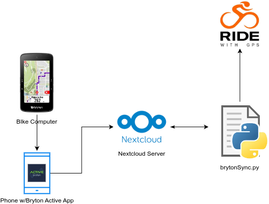

# Bryton Bike Computer Sync

The S800 bike computer that I have doesn't include the ability in it's mobile app (Bryton Active) to upload to RideWithGPS. Using the "Export FIT" option in the app along with a NextCloud server and this script I was able to automate the upload process. Thanks to Jean at RideWithGPS for insight into how their site works even though automated upload isn't offically part of their API.

## Not Covered In This Readme:

- NextCloud Server Setup

## Setup

1. Clone Repo:

   git clone https://github.com/codefiresecurity/NavisNobilite_Bryton.git
2. Install requirements:

   cd NavisNobilite_Bryton
   pip install -r requirements.txt
3. Create app password in NextCloud (Settings > Security):
4. Add login & password to .env file in USERNAME and PASSWORD variables.
5. Add your NextCloud URL to .env NEXTCLOUD_URL variable.
6. Add NextCloud folder name where you will be uploading your FIT files to in .env REMOTE_FOLDER variable.
7. Inside the folder where you will be uploading the FIT files to create another folder where we will move the uploaded FIT files. Place that folder name in the .env REMOTE_DONE_FOLDER variable
8. For notifications you will need the nfty.sh app.
9. Create a topic in the nfty.sh app.
10. Add the topic name in the .env NOTIFY_CHANNEL variable.
11. Add your RideWithGPS email address and password to RWGPS_USER and RWGPS_PASS variables in the .env file. (You may need to set a password in RideWithGPS if you use social logins).
12. Add your RideWithGPS API key to the RWGPS_APIK variable in the .env file. (You can get your key here [https://**ridewithgps**.com/settings/developers](https://ridewithgps.com/settings/developers)
13. Test and use cron or other scheduler to run on a time basis.
